# Memory Piano

A memory game in the style of Simon/Bop It where the player has to remember what notes were played on a piano and play them back. It will get harder as more and more notes have to be remembered.

Created for my Code Institute Interactive Frontend Development milestone project.

A link to the live site can be found [here](https://robknowles248.github.io/memory-game/).

 
## UX

### Primary Goals

To create a memory game that is fun for the user and simple to learn, while getting continually more challenging.

### Developer Goals

- To gain experience using JavaScript and JQuery to create interactive user friendly websites.
- To create a game I will enjoy playing.

### User Stories

As a player of the game I want:

1. Clear and simple instructions on the rules of the game so I am not confused about how to play.
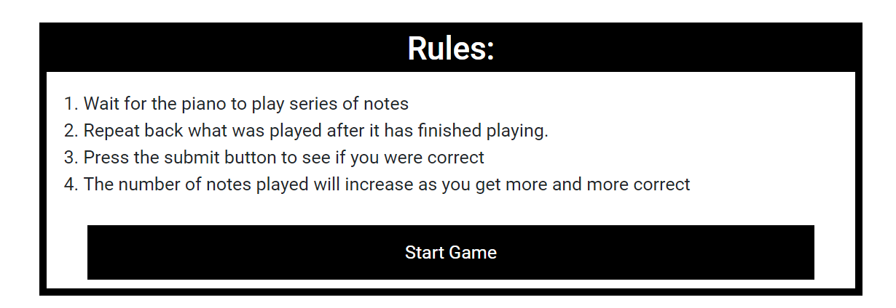

2. An intuitive UI so I can easily play the game.
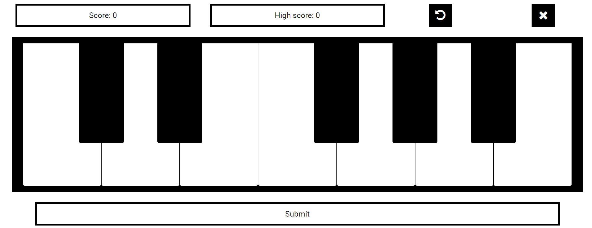

3. Continually increasing difficulty so I do not get bored with the game quickly.

4. A rolling high score to track my progress and give me something to aim for.
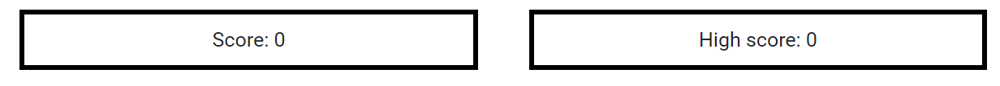

5. Clear feedback when I get a sequence of notes correct or incorrect.

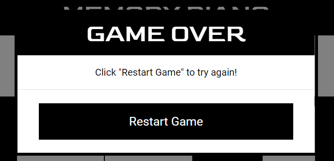

### Wireframes

- [Rules page](assets/wireframes/rules-page.pdf)
- [Game page](assets/wireframes/game-page.pdf)

## Features

- Piano feature on screen which will play notes and you can play back to.
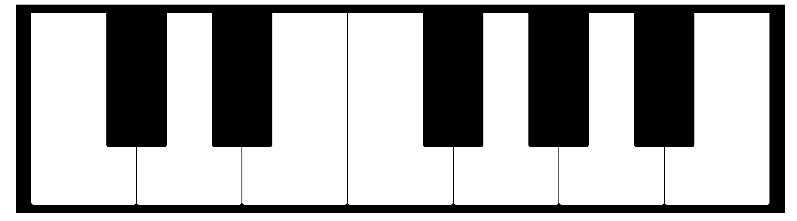

- Rolling score and high scores on screen.

- "Restart game" button to restart the game at any point.
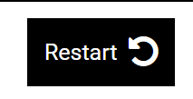

- "Exit game" button to return to the instructions page.
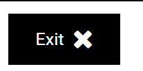

- "Submit" button to see if your sequence of notes was correct.
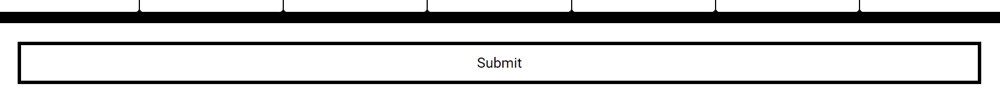

- "Game Over" modal that pops up when you get a sequence wrong and forces you to restart the game.

- "Correct" modal that pops up whenever you get a sequence correct.

- High score value stored in local storage.

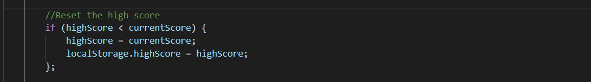

## Technologies Used

- [HTML5](https://en.wikipedia.org/wiki/HTML#:~:text=Hypertext%20Markup%20Language%20(HTML)%20is,scripting%20languages%20such%20as%20JavaScript.)
- [CSS3](https://en.wikipedia.org/wiki/CSS)
- [Bootstrap4](https://getbootstrap.com/)
- [JavaScript](https://en.wikipedia.org/wiki/JavaScript)
- [JQuery](https://jquery.com)

## Testing

- The HTML in both `index.html` and `game.html` was tested using the [W3C Markup Validation Service](https://validator.w3.org/).

- The CSS in `style.css` was tested using the [W3C CSS Validation Service](https://jigsaw.w3.org/css-validator/validator).

- The JavaScript in `piano.js` was tested using [JSHint](https://jshint.com/).

- I tested the responsivity of the site using Chrome developer tools and [http://ami.responsivedesign.is/](http://ami.responsivedesign.is/).

### Functionality Testing

All these tests were performed in both the GitPod local server and the deployed live site on GitHub pages.

- I tested the `"#start-game"` click event by clicking on the button and seeing that it changed page to `game.html` and started the game.
- I tested the `".key"` click event by clicking on a key and seeing that it changed the class to `".active"` for that specific key and played the audio file associated with that key.
- I tested the `"#restart-button"` click event by clicking on the restart button and seeing that the game restarted and the score went to zero.
- I tested the `"#exit-button"` click event by clicking on the exit game button and seeing that the page was changed to `index.html`.
- I tested the `playNotes` function by putting console logs inside the function and playing the game with the console open in Chrome developer tools to make sure the function was workign as expected.
- I tested the `pianoLocked` functionality by trying to click keys while the sequence was playing and seeing that the `playNote` function was not called.
- I tested the `"#submit-button"` by playing the game and seeing that it was only clickable when the game was running and a sequence was not playing:
- I deliberately failed a sequence and clicking Submit to test that the `gameOverModal` popped up.
- I tested the `"#modal-restart-button"` by clicking it and seeing that the modal disappeared and the game restarted.
- I tested the `correctModal` by getting a sequence correct and seeing that the modal popped up and disappeared after 1.5 seconds before the game continued.
- I tested the `updateScores` function by playing the game and seeing that the score and high score was continually updated as expected.
- I tested the `localStorage` functionality of the `highScore` by reloading the page and seeing that the `highScore` remained the same.

### Bugs discovered

1. Game was easy to break as you could click each key directly after it was played
    - I solved this by adding a boolean variable `pianoLocked` that when `true`, stopped all the functionality in the notes click event.
     
    - I then added functionality to the `playNotes` function so that `pianoLocked` was `true` while it was playing notes.
    

2. Audio loading bug
    - The audio files were not loading very quickly so if you started clicking notes before they loaded, the sound was very delayed.
    - Initially the site was composed of one page so you could immediately start clicking notes.
    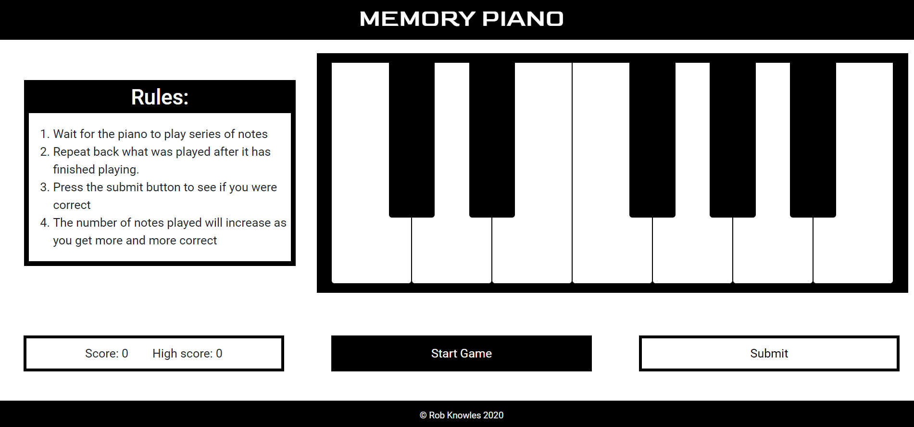
    - I solved this by adding an intro page, `index.html`, to the site with the rules before you were able to start the game at `game.html`.
    
    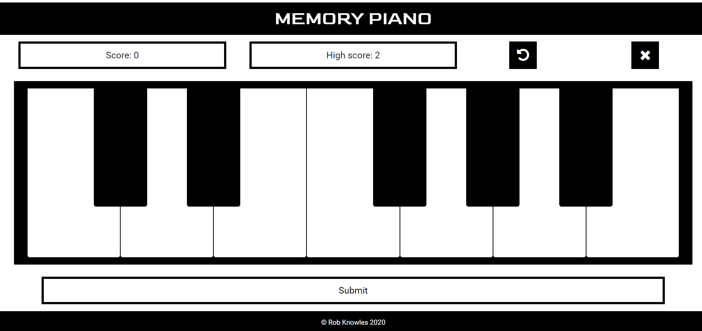
    - I put the sound files on both `index.html` and `game.html` so they would load on `index.html` while you were reading the rules and already be cached so that there were no issues with them loading on `game.html`.
    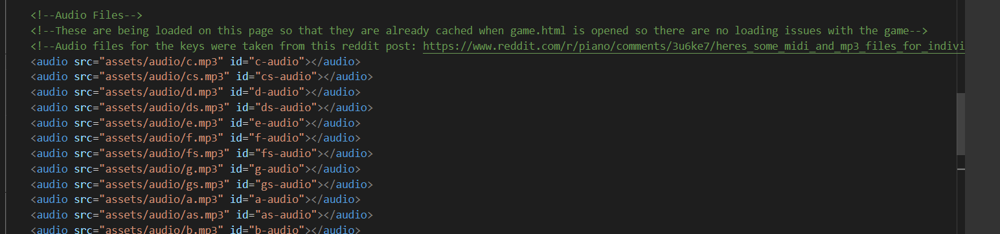

## Deployment

This page was deployed on GitHub pages using the master branch and will automatically update upon any new commits to the master branch.

In order to replicate the process on your own computer you can paste `git clone https://github.com/RobKnowles248/memory-game.git` into the command panel of any code editor and use `git remote rm origin` to cut ties with the original GitHub repository. You can then push this code to GitHub using `git push` making sure that the home page is called `index.html`. To deploy onto GitHub pages you go onto the setting tab of the repository and scroll down to "GitHub Pages". You then choose your source as the master branch and click "save". A link to the deployed website should now appear.

## Credits

### Media

- The audio for the piano keys was obtained from this [Reddit post](https://www.reddit.com/r/piano/comments/3u6ke7/heres_some_midi_and_mp3_files_for_individual/).

### Acknowledgements

- I received inspiration for this project from the memory game [Simon](https://en.wikipedia.org/wiki/Simon_(game)).