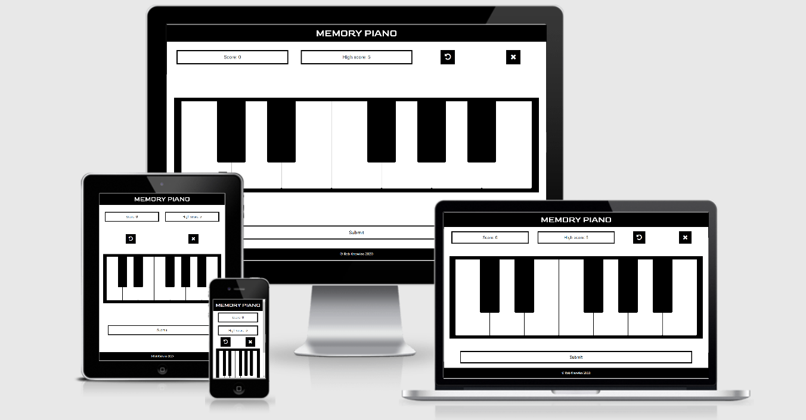

# Memory Piano

A memory game in the style of Simon/Bop It where the player has to remember what notes were played on a piano and play them back. It will get harder as more and more notes have to be remembered.

Created for my Code Institute Interactive Frontend Development milestone project.

A link to the live site can be found [here](https://robknowles248.github.io/memory-game/).

 
## UX

### Primary Goals

To create a memory game that is fun for the user and simple to learn, while getting continually more challenging.

### Developer Goals

- To gain experience using JavaScript and JQuery to create interactive user friendly websites.
- To create a game I will enjoy playing.

### User Stories

As a player of the game I want:

1. Clear and simple instructions on the rules of the game so I am not confused about how to play.

2. An intuitive UI so I can easily play the game.

3. Continually increasing difficulty so I do not get bored with the game quickly.

4. A rolling high score to track my progress and give me something to aim for.

5. Clear feedback when I get a sequence of notes correct or incorrect.

### Wireframes

- [Main page](assets/wireframes/memory-piano.pdf)

## Features

In this section, you should go over the different parts of your project, and describe each in a sentence or so.

- Piano feature on screen which will play notes and you can play back to.
- Rolling score and high scores on screen.
- "Restart game" button to restart the game at any point.
- "Submit" button to see if your sequence of notes was correct.
- "Game Over" modal that pops up when you get a sequence wrong and forces you to restart the game.

## Technologies Used

- [HTML5](https://en.wikipedia.org/wiki/HTML#:~:text=Hypertext%20Markup%20Language%20(HTML)%20is,scripting%20languages%20such%20as%20JavaScript.)
- [CSS3](https://en.wikipedia.org/wiki/CSS)
- [Bootstrap4](https://getbootstrap.com/)
- [JavaScript](https://en.wikipedia.org/wiki/JavaScript)
- [JQuery](https://jquery.com)

## Testing

- The HTML in both `index.html` and `game.html` was tested using the [W3C Markup Validation Service](https://validator.w3.org/).

- The CSS in `style.css` was tested using the [W3C CSS Validation Service](https://jigsaw.w3.org/css-validator/validator).

- I tested the responsivity of the site using Chrome developer tools and [http://ami.responsivedesign.is/](http://ami.responsivedesign.is/).

### Bugs discovered

1. Game was easy to break as you could click each key directly after it was played
    - I solved this by adding a boolean variable `pianoLocked` that when `true`, stopped all the functionality in the notes click event.
     
    - I then added functionality to the `playNotes` function so that `pianoLocked` was `true` while it was playing notes.
    

2. Audio loading bug
    - The audio files were not loading very quickly so if you started clicking notes before they loaded, the sound was very delayed.
    - Initially the site was composed of one page so you could immediately start clicking notes.
    - I solved this by adding an intro page, `index.html`, to the site with the rules before you were able to start the game at `game.html`.
    - I put the sound files on both `index.html` and `game.html` so they would load on `index.html` while you were reading the rules and already be cached so that there were no issues with them loading on `game.html`.

## Deployment

This page was deployed on GitHub pages using the master branch and will automatically update upon any new commits to the master branch.

In order to replicate the process on your own computer you can paste `git clone https://github.com/RobKnowles248/memory-game.git` into the command panel of any code editor and use `git remote rm origin` to cut ties with the original GitHub repository. You can then push this code to GitHub using `git push` making sure that the home page is called `index.html`. To deploy onto GitHub pages you go onto the setting tab of the repository and scroll down to "GitHub Pages". You then choose your source as the master branch and click "save". A link to the deployed website should now appear.

## Credits

### Media

- The audio for the piano keys was obtained from this [Reddit post](https://www.reddit.com/r/piano/comments/3u6ke7/heres_some_midi_and_mp3_files_for_individual/).

### Acknowledgements

- I received inspiration for this project from the memory game [Simon](https://en.wikipedia.org/wiki/Simon_(game)).